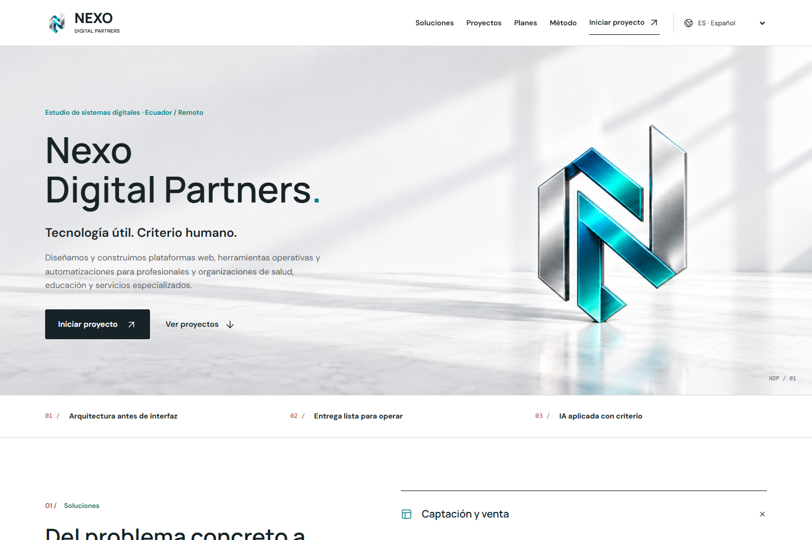

# Nexo Digital Partners

Webs profesionales, herramientas operativas y automatizacion para profesionales y pequenos negocios. Definimos el problema, acordamos el alcance y construimos una primera entrega que se pueda probar.

[Ver el sitio](https://nexodipa.github.io/nexo-digital-partners/) · [Solicitar una propuesta](https://nexodipa.github.io/nexo-digital-partners/#contacto) · [Recursos en Gumroad](https://pugmaster0.gumroad.com/)



Proyecto propio. La captura muestra la web; el monograma de su cabecera es una ilustracion de marca, no una fotografia de nuestras instalaciones. [Procedencia de los activos](assets/brand/ASSETS.md).

## Herramientas que puedes probar

[Casos de proyecto ES / EN: problema, solucion, demo y limites](launch/portfolio-cases.md).

| Herramienta | Para que sirve | Probar y revisar |
| --- | --- | --- |
| Nexo Brief | Ordenar objetivo, publico, alcance y entregables. Interfaz ES/EN, guardado manual, importacion JSON y exportaciones JSON/Markdown. | [Abrir](https://nexodipa.github.io/nexo-digital-partners/products/brief-kit/) / [Descarga gratuita con aportacion opcional](https://pugmaster0.gumroad.com/l/nexo-brief) / [Codigo y guia](products/brief-kit/) |
| Nexo Catalog | Revisar un CSV de productos: columnas asignables, precios, existencias, SKU duplicados e informes exportables. Interfaz ES/EN. | [Abrir](https://nexodipa.github.io/nexo-digital-partners/products/catalog-check/) / [Codigo y guia](products/catalog-check/) |

Ambas herramientas trabajan con datos locales en el navegador. No envian el contenido de las fichas o CSV a Nexo. La version alojada genera las solicitudes web normales al proveedor de alojamiento. No introduzcas contrasenas, datos clinicos ni informacion sensible; las exportaciones no estan cifradas.

Nexo Catalog usa Papa Parse, no IA ni OCR, y no esta integrado con un ERP. Nexo Brief no incluye consultoria ni desarrollo a medida. Su opcion de impresion depende del navegador; la salida PDF paginada sigue pendiente de comprobacion.

## Servicios con alcance definido

[Contratar la landing en Fiverr](https://www.fiverr.com/josuep744/build-a-responsive-landing-page-for-your-professional-service): USD 150, 7 dias, hasta cinco secciones, un idioma y dos revisiones. El alcance completo y las exclusiones estan en la ficha publicada; no incluye todos los servicios de Nexo.

- Landing pages y webs profesionales para presentar una oferta y recibir consultas.
- Formularios, catalogos, dashboards y microaplicaciones para un flujo concreto.
- Arquitectura de contenido y experiencias multilingues, con idiomas y revision acordados.
- Kits manuales de trabajo con IA; integraciones y ejecucion automatica se cotizan aparte.

Las opciones de servicio, ejemplos y contacto estan en el [sitio comercial](https://nexodipa.github.io/nexo-digital-partners/#planes). Dominio, alojamiento, servicios externos y mantenimiento se acuerdan por separado. [Entregables, exclusiones y criterios de aceptacion](launch/service-offers.md).

Los trabajos del portafolio son proyectos propios o prototipos identificados como tales. No se presentan como encargos de clientes, testimonios ni pruebas de ventas. No garantizamos trafico, posicionamiento o resultados comerciales. Las ideas investigadas en [GitHub y Hugging Face](launch/research.md) se distinguen de las funciones implementadas.

## Sitio comercial

HTML, CSS y JavaScript estaticos, sin backend de captacion ni compilacion. El formulario prepara un mensaje para que el visitante lo revise y decida enviarlo por WhatsApp o correo; no envia la solicitud automaticamente.

Selector en doce idiomas: ES, EN, DE, FR, PT, IT, RU, CS, ZH, JA, HE y AR. Hebreo y arabe usan RTL. Los doce idiomas pertenecen al sitio comercial: las dos herramientas tienen interfaz ES/EN.

## Ejecutar y comprobar

Abre `index.html` para el sitio, o `products/brief-kit/index.html` y `products/catalog-check/index.html` para las herramientas. Conserva sus archivos y carpetas de recursos.

Las comprobaciones siguientes usan Node.js y Python 3, sin instalar paquetes adicionales:

```sh
python scripts/audit-localization.py
node scripts/test-offer-copy.cjs
node scripts/test-brief.cjs
node scripts/test-catalog.cjs
python -B scripts/test_brief_package.py
python scripts/check_brief_package.py
```

La auditoria de traducciones acepta `--node /ruta/al/ejecutable` cuando Node no esta en PATH. El control del ZIP compara todos sus archivos con `products/brief-kit/`, rechaza archivos faltantes, inesperados, duplicados o diferentes y no extrae ni ejecuta el contenido.

Estas pruebas cubren reglas de datos, traducciones, recursos y coherencia del paquete; no sustituyen una revision visual o una prueba de compra. Las comprobaciones de navegador y sus limites estan en [el registro de lanzamiento](launch/STATUS.md), incluyendo [contacto y recurso gratuito](launch/brief-contact-verification-2026-09-15.md) y [revision CSV](launch/catalog-verification-2026-09-13.md).

Para regenerar el ZIP, `scripts/package-brief.cjs` requiere JSZip. Su resultado es `products/nexo-brief-v1.zip`; despues se debe ejecutar el control del paquete. Actualizar este repositorio no reemplaza automaticamente el archivo ya cargado en Gumroad.

## Publicacion y estructura

El [workflow de GitHub Pages](.github/workflows/pages.yml) ejecuta los controles antes de publicar `main`. Si falla uno, no se despliega esa revision.

| Ruta | Contenido |
| --- | --- |
| `index.html`, `styles.css`, `script.js` | Sitio comercial y formulario de solicitud |
| `translations.js`, `studio-copy.js`, `locale-completion.js` | Catalogos y textos activos de los doce idiomas |
| `products/` | Herramientas, guias y paquete descargable |
| `assets/` | Identidad, capturas propias y bibliotecas locales |
| `scripts/` | Controles y utilidades de empaquetado |
| `launch/` | Alcances, evidencia de pruebas y estado real del lanzamiento |
| `social/` | Publicaciones, enlaces verificados y borradores identificados |

Los scripts historicos `verify-site.cjs` y `capture-portfolio.cjs` requieren configuracion de navegador y, para algunas capturas, proyectos vecinos. No forman parte del despliegue automatico ni demuestran por si solos el estado actual del sitio.

## Activos y componentes

Lucide conserva su [licencia incluida](assets/vendor/lucide-LICENSE), al igual que [Papa Parse](products/catalog-check/vendor/LICENSE). Las condiciones de uso de Nexo Brief estan en [su guia](products/brief-kit/README.md). No se ha aplicado una licencia general de codigo abierto a la marca ni al conjunto del repositorio.

[LinkedIn](https://www.linkedin.com/company/nexo-digital-partners-ec/) · [Facebook](https://www.facebook.com/profile.php?id=61591254974802)
